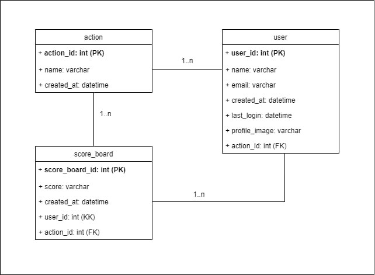
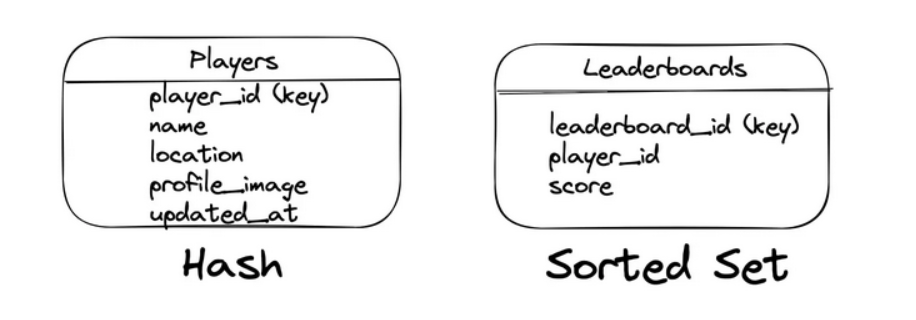
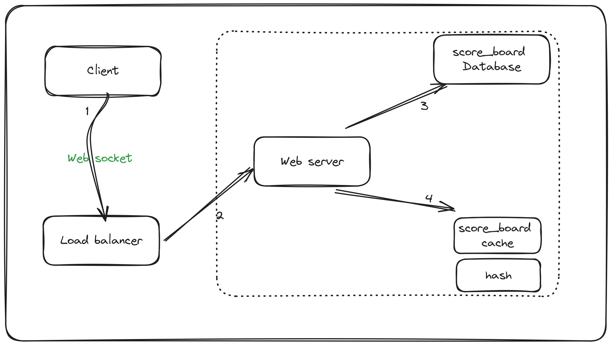
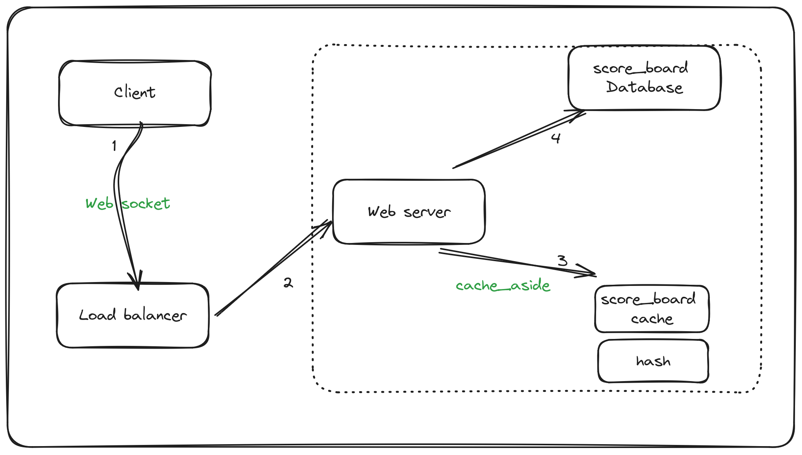

# 99Tech PROBLEM #6 ARCHITECTURE

## SPECIFICATION MODULE

-   Module: **Score Board Module**
-   This module provides an API endpoint for updating user scores upon completing an action. It ensures that only authorized users can update scores, thus preventing malicious users from tampering with scores.

### Functional Requirement

-   Display score board: The ScoreBoard module displays a list of users with the highest scores in the system, limited to a maximum of 10 users.
-   Show User Information: For each user, it displays their username, score, and their position in the scoreboard.
-   Update Information: This module has the ability to automatically update information from the database or from an external API to ensure that the scoreboard is always up to date.

### Non Functional Requirement

-   Performance:
    -   The ScoreBoard module should load and display the scoreboard quickly, even with a large number of users.
    -   Response time for updating the scoreboard information should be minimal to ensure a smooth user experience.
-   Scalability:The module should be able to handle an increasing number of users and scores without significant degradation in performance.
-   Security:
    -   User authentication and authorization mechanisms should be implemented to ensure that only authorized users can access the scoreboard.
    -   Rate limit the requests

### Class diagram for Relational Database

    

### Scoreboard for Redis schema

    

### Update score workflow

    

-   1: The client creates a WebSocket connection to the load balancer for real-time communication
-   2: The load balancer delegates the client’s request to the closest data center
-   3: The server updates the player’s score record on the relational database following the cache-aside pattern
-   4: The server updates the same player’s score record on the cache server following the cache-aside pattern

### Display scoreboard workflow

    

-   1: The client creates a WebSocket connection to the load balancer for real-time communication
-   2: The load balancer delegates the client’s request to the closest data center
-   3: The server queries the cache server to display the scoreboard
-   4: The server queries the relational database on a cache miss and populates the cache server with fetched data
-   The server-sent events (SSE) or WebSockets can be used for real-time updates on the scoreboard
-   The sorted set is a unique collection of items (players) sorted based on the associated score. The hash data type on the cache server can be used to store the player metadata. The Least Recently Used (LRU) policy can be used for cache eviction

## API Endpoint 1

-   Endpoint: /api/v1/top/:count
-   Method: GET

### Request Parameters

-   count : select the number of top user.

### Header

-   authorization: Bearer <JWT>

### Description

-   Get top score user

### Response

    Status Code: 200 OK
        Content: {
          "total": 10(count) ,
          "updated_at" : "",
          "data" :
          [
            "userId":"1234".
            "name":"abc",
            "score": 1562,
            "rank": 1,
          ],
          ...
        }

    Status Code: 401 Unauthorized
        Content: { "error": "Unauthorized: Invalid auth token" }

    Status Code: 403 Forbidden
        Content: { "error": "Forbidden: User not authorized score" }

    Status Code: 404 Not Found
        Content: { "error": "Not Found: User not found" }

    Status Code: 500 Internal Server Error
        Content: { "error": "Internal Server Error" }

## API Endpoint 2

-   Endpoint: /api/v1/do-action
-   Method: POST

### Request Parameters

### Header

-   authorization: Bearer <JWT>

### Request Body Example

-   {
    -   "userId": "123456",
    -   "score" : 12
-   }

### Response

    Status Code: 200 OK
        Content: { "message": "Score updated successfully" }

    Status Code: 401 Unauthorized
        Content: { "error": "Unauthorized: Invalid auth token" }

    Status Code: 403 Forbidden
        Content: { "error": "Forbidden: User not authorized score" }

    Status Code: 404 Not Found
        Content: { "error": "Not Found: User or action not found" }

    Status Code: 500 Internal Server Error
        Content: { "error": "Internal Server Error" }
